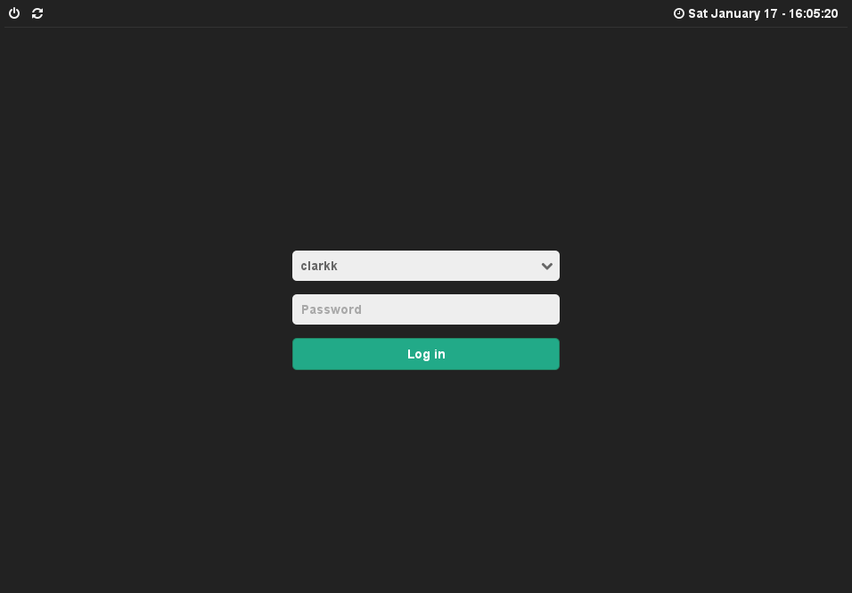

# lightdm-webkit-theme-gracilis

Simple lightdm-webkit greeter theme



## TODO

- [ ] handle multiple sessions
- [ ] cleanup greeter code
- [ ] create `PKGBUILD`

### Quick installation

```
$ git clone https://github.com/mikkeloscar/lightdm-webkit-theme-gracilis.git
```

```
sudo cp -r lightdm-webkit-theme-gracilis /usr/share/lightdm-webkit/themes/gracilis
```
Set `webkit-theme` to `gracilis` in `/etc/lightdm/lightdm-webkit-greeter.conf`.
